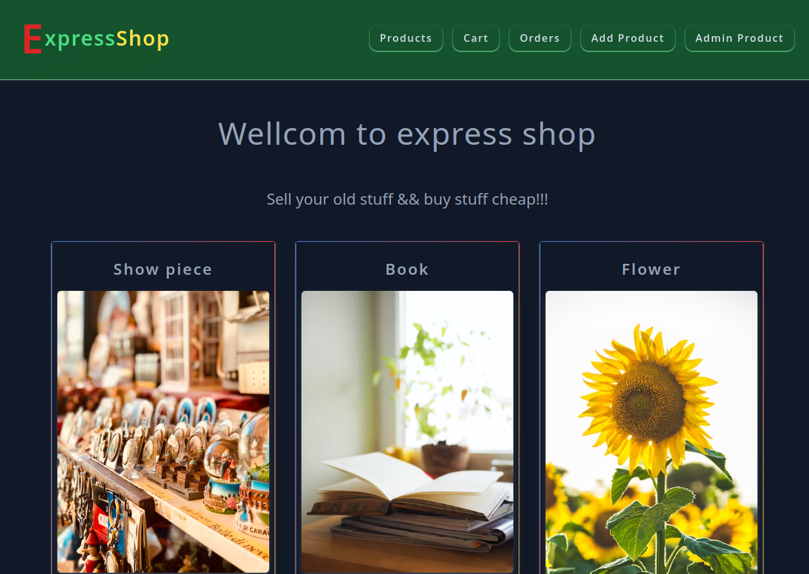
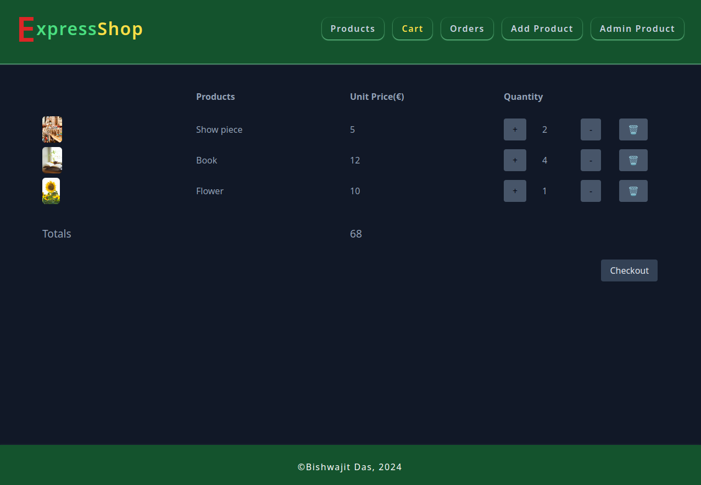

# Express shop

A CRUD app where user can list their products and buy products from other users.

## Technologies and features

- Nodejs
- Express
- Ejs
- MongoDB
- Mongoose ODM
- Session & Cookie
- Authentication
- Authorization
- Zod : User input or params are validated with Zod schemas.
- Multer : User can upload image from local machine.
- pdfKit : User can download invoice as pdf.
- Pagination : Limiting data based on number of items render on a page.

## Author

Bishwajit Das (Bisso)

## Screenshots

