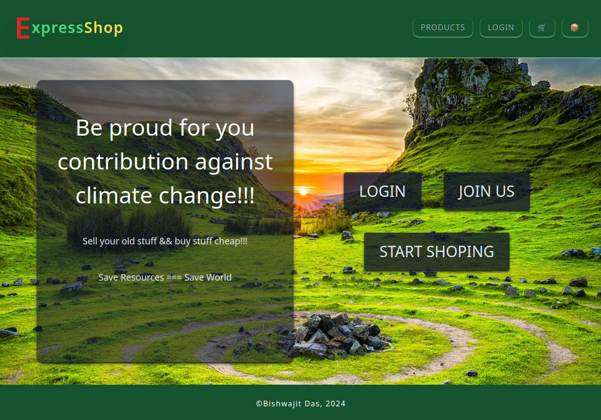

# Express shop

It is a Full stuck CRUD app built with Nodejs, Express, Ejs, and MongoDB. This app is a website for a C2C business. Users can create Their own accounts and list products to sell and buy products from others. They can update or delete their listing from the admin route. If a user forgets their password, they can reset the password throw the email address they have used during registration. All the user inputs and params values come to the server and go throw Zod validation. If the validations fail users are given feedback.

## Live site

<a href="https://express-shop-mx2o.onrender.com/" target="_blank" >https://express-shop-mx2o.onrender.com/</a>

## Technologies and features

- Nodejs
- Express
- Ejs
- MongoDB
- Mongoose ODM
- Session & Cookie
- Authentication
- Authorization
- Zod : User input or params are validated with Zod schemas.
- Multer : User can upload image from local machine.
- pdfKit : User can download invoice as pdf.
- Pagination : Limiting data based on number of items render on a page.

## Author

Bishwajit Das (Bisso)

## Screenshots

